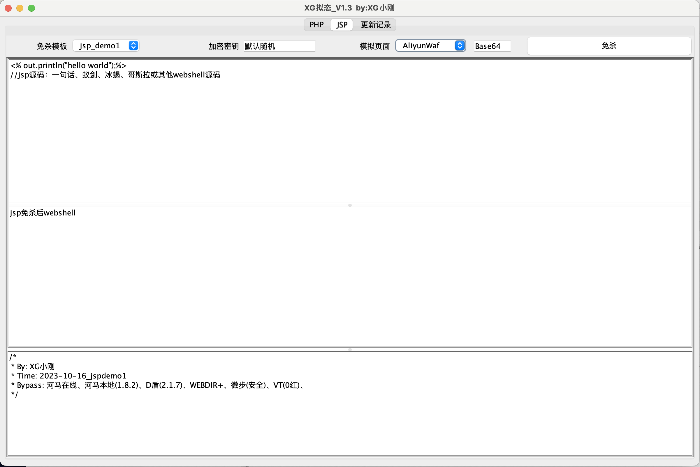
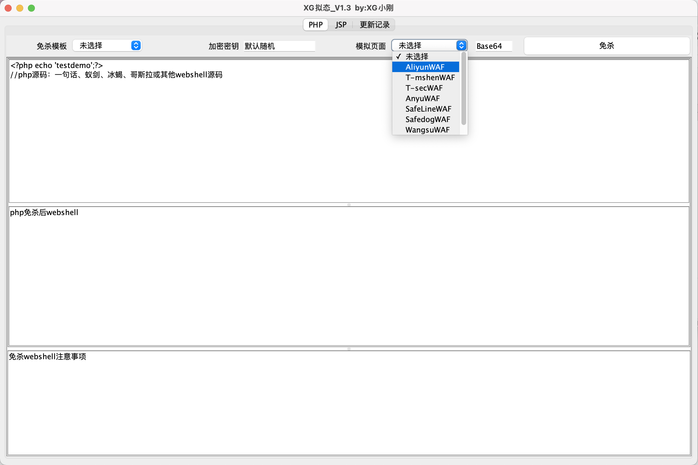
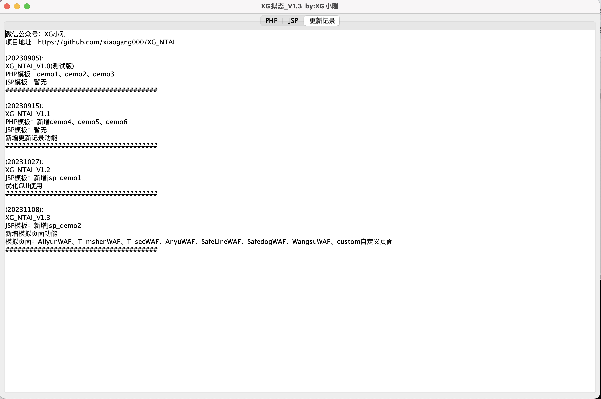

# XG拟态

>  公众号 : XG小刚

一键免杀冰蝎、哥斯拉等webshell的php、jsp木马文件。(注：不支持流量混淆)


## 使用方法

目前搭载6种php模板、2种jsp模板、7种waf页面（注：jsp免杀需要JAVA8）

```
java -jar XG_NTAI.jar
```


### 静态免杀

1、选择PHP、JSP页面，选择免杀模板，加密密钥可自定义

2、源码区替换为冰蝎、哥斯拉的php、jsp源码

4、点击免杀，获取免杀后代码即可

5、部分免杀马在第三文本框有特殊传参要求





### 模拟页面

可在生成时添加模拟页面、目前支持7种waf页面




也可以选择custom添加自定义页面的base64编码


### 注意

jsp免杀500等问题，受Tomcat版本和Java版本影响

```
tomcat7 : 暂不支持
tomcat8 jdk6-8 : 使用jsp_demo1
tomcat8/9 jdk8-21 : 使用jsp_demo2
tomcat10以上 : 修改pom.xml文件中所有8.5.93=>10.0.27,再使用jsp_demo2
```


## 更改记录

(20230905):

XG_NTAI_V1.0(测试版)

PHP模板：demo1、demo2、demo3

JSP模板：暂无

######################################

(20230915):

XG_NTAI_V1.1

PHP模板：新增demo4、demo5、demo6

JSP模板：暂无

新增更新记录功能

######################################

(20231027):

XG_NTAI_V1.2

JSP模板：新增jsp_demo1

优化GUI使用

######################################

(20231108):

XG_NTAI_V1.3

JSP模板：新增jsp_demo2

新增模拟页面功能

模拟页面：AliyunWAF、T-mshenWAF、T-secWAF、AnyuWAF、SafeLineWAF、SafedogWAF、WangsuWAF、custom自定义页面

######################################

