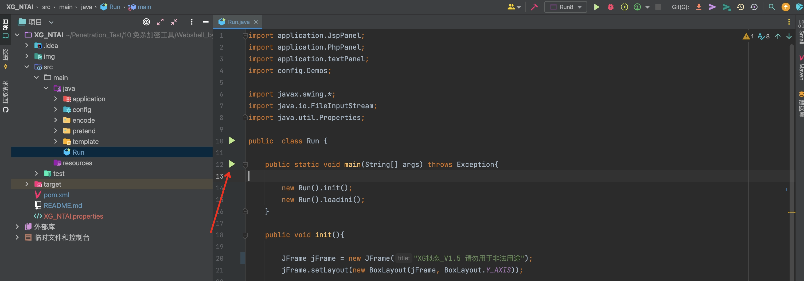
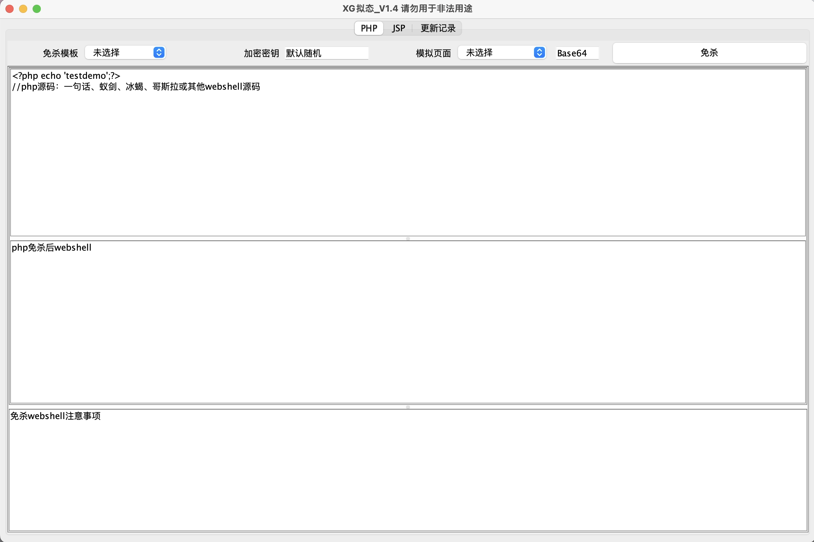
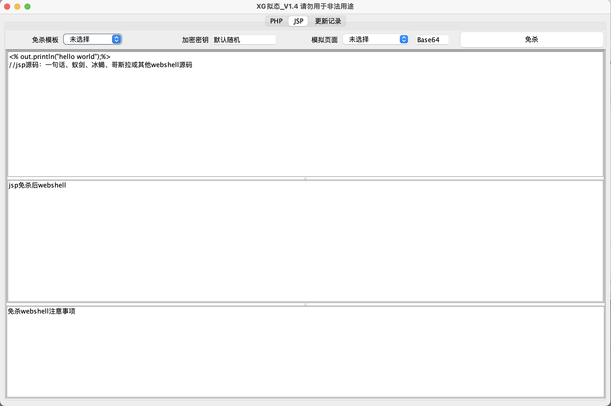
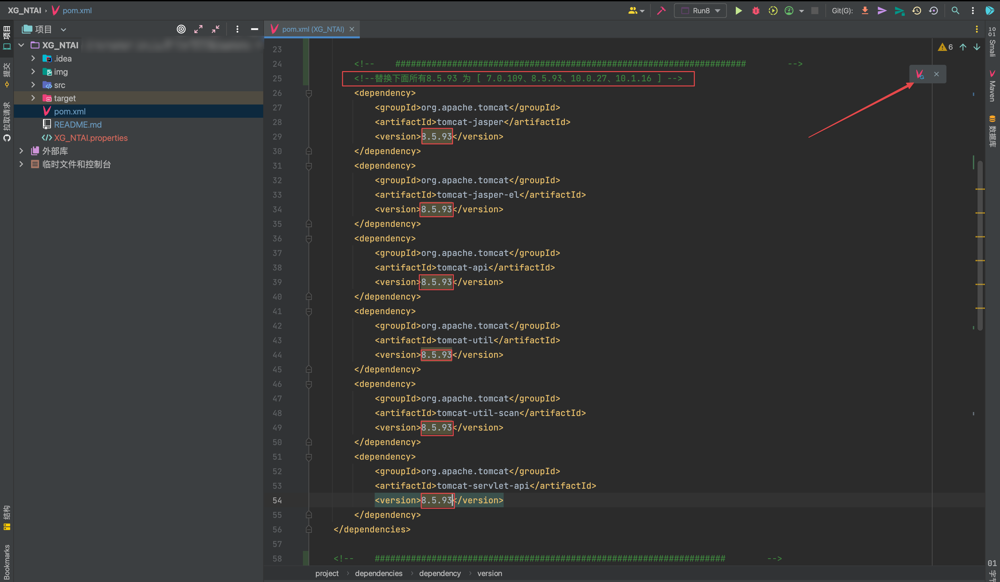
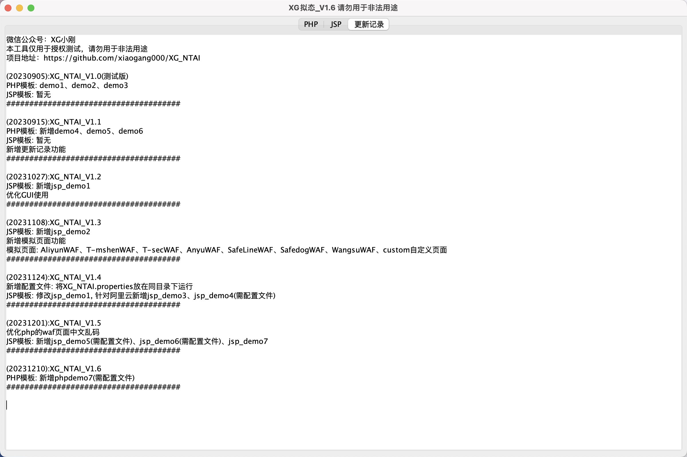

# XG拟态

>  公众号 : XG小刚
> 
> 项目地址：https://github.com/xiaogang000/XG_NTAI

一键免杀冰蝎、哥斯拉等webshell的php、jsp木马文件。(注：不支持流量混淆)

```
本工具仅用于授权测试，请勿用于非法用途
```


## 使用方法

目前搭载7种php模板、7种jsp模板、7种waf页面（注：jsp免杀最好JAVA8运行）

```
java -jar XG_NTAI.jar
```

或者

```
git clone https://github.com/xiaogang000/XG_NTAI.git
```

使用IEDA配置好java8运行Run.java即可




### 静态免杀

1、选择PHP、JSP页面，选择免杀模板，加密密钥可自定义(不重要)

2、源码区替换为冰蝎、哥斯拉、或其他恶意代码的php、jsp源码

3、点击免杀，获取免杀后代码即可

4、部分免杀马在第三文本框有使用注意事项






### 模拟页面

可在生成时添加模拟页面、目前支持7种waf页面


也可以选择custom添加自定义页面的base64编码


### 配置文件

部分demo需要加载配置文件XG_NTAI.properties才能使用

将XG_NTAI.properties放在同目录下运行即可


配置文件有需求加我微信咨询，进知识星球（黑灰产别来沾边）


### 注意

jsp免杀500等问题，受Tomcat版本、Java版本影响

使用IDEA修改pom.xml文件中版本为需要版本，然后更新maven后再运行程序即可

```
tomcat7.0.x/8.x	jdk6-8:	修改pom.xml文件版本后，使用jsp_demo1、jsp_demo6、jsp_demo7
tomcat8.x/9.0.x	jdk8-21:	使用jsp_demo2、jsp_demo5、jsp_demo7
tomcat10.0.x	jdk8-21:	修改pom.xml文本版本后,使用jsp_demo2、jsp_demo3、jsp_demo4、jsp_demo5、jsp_demo7
tomcat10.1.x	jdk8-21:	修改pom.xml文本版本后,使用jsp_demo5、jsp_demo7
```



原生冰蝎jsp不支持tomcat10.1.x了，哥斯拉是可以的


## 更新记录

(20230905): XG_NTAI_V1.0(测试版)

PHP模板：demo1、demo2、demo3

JSP模板：暂无

######################################

(20230915): XG_NTAI_V1.1

PHP模板：新增demo4、demo5、demo6

JSP模板：暂无

新增更新记录功能

######################################

(20231027): XG_NTAI_V1.2

JSP模板：新增jsp_demo1

优化GUI使用

######################################

(20231108): XG_NTAI_V1.3

JSP模板：新增jsp_demo2

新增模拟页面功能

模拟页面：AliyunWAF、T-mshenWAF、T-secWAF、AnyuWAF、SafeLineWAF、SafedogWAF、WangsuWAF、custom自定义页面

######################################

(20231124)：XG_NTAI_V1.4

新增配置文件：将XG_NTAI.properties放在同目录下运行

JSP模板: 修改jsp_demo1, 针对阿里云新增jsp_demo3、jsp_demo4(需配置文件)

######################################

(20231201): XG_NTAI_V1.5

优化php的waf页面中文乱码

JSP模板: 新增jsp_demo5(需配置文件)、jsp_demo6(需配置文件)、jsp_demo7

######################################

(20231210): XG_NTAI_V1.6

PHP模板: 新增phpdemo7(需配置文件)

######################################


